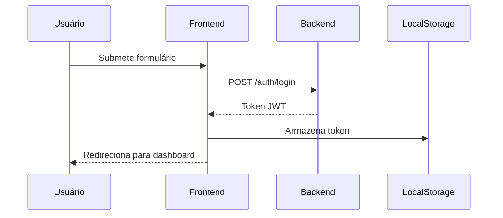

# 🚗 Rodas e Motores - Plataforma de Veículos


[](https://react.dev/)
[](https://www.typescriptlang.org/)
[](https://mui.com/)

Plataforma web para compra e venda de veículos usados, oferecendo uma experiência intuitiva para usuários e anunciantes.

[Clique aqui para acessar](https://rodas-e-motores-gnvc2tp0k-rafaeldamascenos-projects.vercel.app)

## ✨ Funcionalidades Principais

- **Sistema de Autenticação Segura**
  - Cadastro de novos usuários
  - Login com token JWT
  - Controle de sessão persistente
  
- **Interface Moderna**
  - Componentes reutilizáveis
  - Navegação intuitiva
  
## 🛠 Tecnologias Utilizadas

| Tecnologia       | Descrição                                 |
|------------------|-------------------------------------------|
| React            | Biblioteca frontend para construção de UI |
| TypeScript       | Tipagem estática para JavaScript          |
| Material UI      | Componentes UI modernos e responsivos     |
| React Router DOM | Controle de navegação SPA                 |
| Axios            | Cliente HTTP para integração com API      |
| Prettier         | Formatação consistente de código          |

## 🚀 Como Executar

1. **Clone o repositório**
   ```bash
   git clone https://github.com/seu-usuario/rodas-e-motores.git
   ```

2. **Instale as dependências**
   ```bash
   npm install
   ```

3. **Inicie o servidor de desenvolvimento**
   ```bash
   npm run dev
   ```

## 🔄 Fluxo de Autenticação



## 📌 Próximas Melhorias
- [ ] Responsividade 
- [ ] Sistema avançado de busca por filtros
- [ ] Upload de imagens para anúncios
- [ ] Sistema de favoritos
- [ ] Dashboard de gerenciamento de anúncios
- [ ] Integração com serviços de pagamento
- [ ] Melhorias de performance (lazy loading)


---

**Desenvolvido com ❤️ por Rafael Damasceno**  
⚡ [Reportar Bug](https://github.com/seu-usuario/rodas-e-motores/issues)

